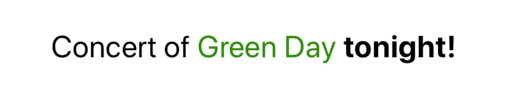
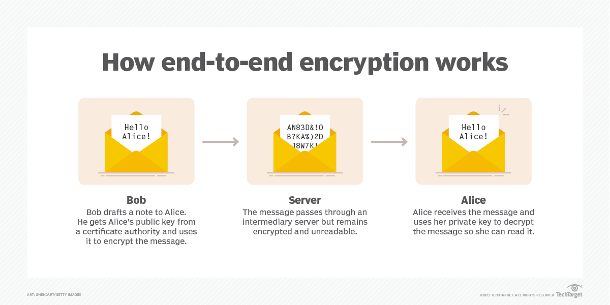
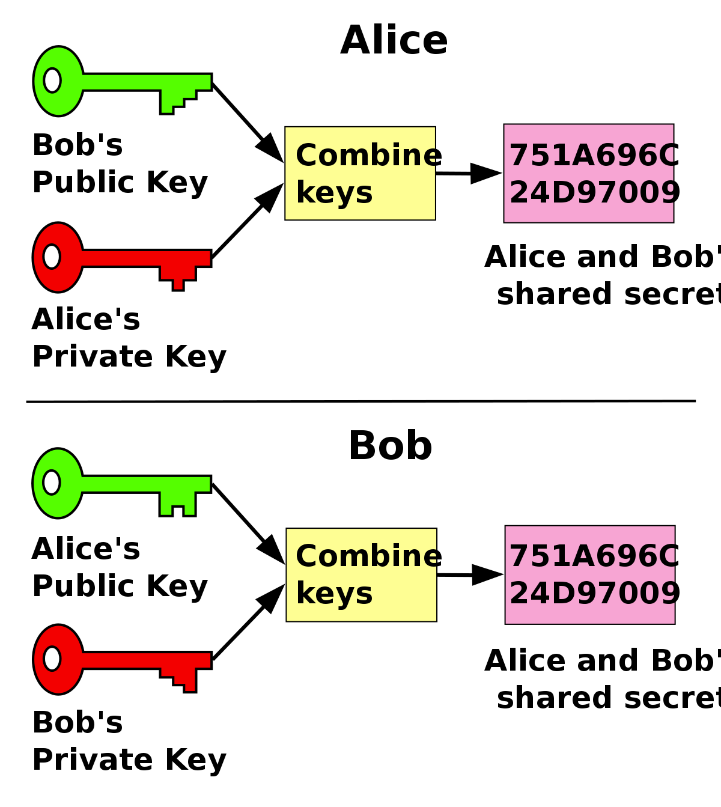
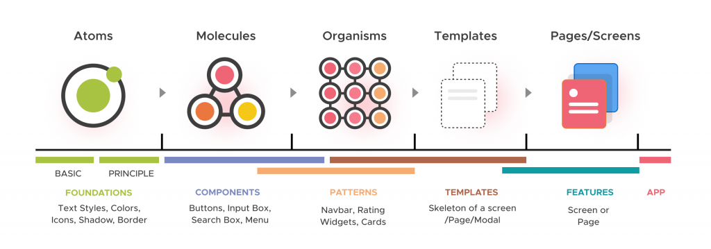

# Translation

## I. configuration

1. Install

```shell
yarn add --dev @lingui/cli @babel/core
yarn add --dev @lingui/macro babel-plugin-macros
yarn add @lingui/react
```

2. Add plugin to Babel config

```json
{
    "plugins": ["macros"]
}
```

3. Create lingui.config.js

```shell
# in root project
mkdir "lingui.config.js"
vi "lingui.config.js"
# copy & paste configs below & ESC
:wq
```

```js
module.exports = {
    format: "po",
    orderBy: "origin",
    locales: ["en"], // add your lang .eg: locales: ["en", "zh", "fr", "ru", "ta"],
    sourceLocale: "en",
    catalogs: [
        {
            path: "src/locales/{locale}/messages",
            include: ["src"]
        }
    ],
    fallbackLocales: {
        default: "en"
    },
    formatOptions: {
        origins: true,
        lineNumbers: false
    }
};
```

4. script package.json

```json
"lang:extract": "lingui extract",
"lang:compile": "lingui compile"
```

5. Check the installation by running:

```shell
yarn lang:extract
yarn lang:compile
```

```html
Catalog statistics: ┌──────────┬─────────────┬─────────┐ │ Language │ Total count │ Missing │
├──────────┼─────────────┼─────────┤ │ cs │ 0 │ 0 │ │ en │ 0 │ 0 │ │ fr │ 0 │ 0 │
└──────────┴─────────────┴─────────┘ (use "lingui extract" to update catalogs with new messages)
(use "lingui compile" to compile catalogs for production)
```

6. husky (optional)

```json
"husky": {
    "hooks": {
        "pre-commit": "lingui extract $(git diff --name-only --staged)"
    }
},
```

Filters source paths to only extract messages from passed files

```shell
lingui extract src/components
```

## II. How to use?

### 1. Translating:

```ts
<Text style={styles.heading}><Trans>Message Inbox</Trans></Text>
```

#### The solution is to use the t macro together with the i18n object which we can obtain from the useLingui hook. We use the two like this to get a translated string:

```ts
const { i18n } = useLingui();
```

```ts
<Button title={t(i18n)`this will be translated and rerendered with locale changes`}/>
```

### 2. Translating Outside:

```ts
import { i18n } from "@lingui/core";
```

```ts
const deleteTitle = msg`Are you sure to delete this?`;
```

```ts
const showDeleteConfirmation = () => {
    Alert.alert(i18n._(deleteTitle));
};
```

### 3. Nesting components



```ts
<Trans>
  <Text style={{ fontSize: 20 }}>
    <Text>Concert of </Text>
    <Text style={{ color: "green" }}>Green Day</Text>
    <Text style={{ fontWeight: "bold" }}> tonight!</Text>
  </Text>
</Trans>
```

The extracted string for translation will look like this:

```ts
"<0><1>Concert of </1><2>Green Day</2><3> tonight!</3></0>";
```

### 4. Changing the active locale

The last remaining piece of the puzzle is changing the active locale. The i18n object exposes i18n.loadAndActivate() for that. Call the method and the I18nProvider will re-render the translations. It all becomes clear when you take a look at the final code.

```ts
const loadAndActivateLocale = () => {
    const activeLanguage = i18n.locale;
    const newActiveLanguage = activeLanguage === "en" ? "cs" : "en";
    const catalog =
      newActiveLanguage === "en"
        ? require("./locales/en/messages.js")
        : require("./locales/cs/messages.js");
    i18n.load(newActiveLanguage, catalog.messages);
    i18n.activate(newActiveLanguage);
  };

<Button
    onPress={loadAndActivateLocale}
    title={t`Toggle language to ${i18n.locale === "en" ? "cs" : "en"}`}
/>
```

### How does end-to-end encryption work?



### Diffie-Hellman

In the Diffie–Hellman key exchange scheme, each party generates a public/private key pair and distributes the public key. After obtaining an authentic copy of each other's public keys, Alice and Bob can compute a shared secret offline. The shared secret can be used, for instance, as the key for a symmetric cipher.



```js
const crypto = require("crypto");

// Step 1: Agree on prime numbers and base
const prime = 23; // Prime number
const base = 5; // Primitive root modulo prime

// Step 2: Generate private and public keys
const alicePrivate = 6;
const bobPrivate = 15;

const alicePublic = Math.pow(base, alicePrivate) % prime;
const bobPublic = Math.pow(base, bobPrivate) % prime;

// Step 3: Compute shared secret
const aliceSharedSecret = Math.pow(bobPublic, alicePrivate) % prime;
const bobSharedSecret = Math.pow(alicePublic, bobPrivate) % prime;

// Step 4: Encryption and Decryption
const message = "Hello, Bob!"; // Message to be encrypted

// Encryption (Alice)
const cipher = crypto.createCipheriv(
    "aes-256-cbc",
    Buffer.from(aliceSharedSecret.toString()),
    crypto.randomBytes(16)
);
let encryptedMessage = cipher.update(message, "utf8", "hex");
encryptedMessage += cipher.final("hex");

// Decryption (Bob)
const decipher = crypto.createDecipheriv(
    "aes-256-cbc",
    Buffer.from(bobSharedSecret.toString()),
    crypto.randomBytes(16)
);
let decryptedMessage = decipher.update(encryptedMessage, "hex", "utf8");
decryptedMessage += decipher.final("utf8");

console.log("Encrypted Message:", encryptedMessage); // Sent over the insecure channel
console.log("Decrypted Message:", decryptedMessage); // Decrypted by the receiver
```

# Atomic Design



1. Atoms: Atoms are the basic building blocks of a UI, such as buttons, input fields, and labels. In React Native, these could be individual components that represent the smallest UI elements.

2. Molecules: Molecules are groups of atoms that work together as a unit. For example, a search bar composed of an input field (atom) and a search button (atom) can be considered a molecule. In React Native, molecules are components made up of atom components.

3. Organisms: Organisms are larger components that combine molecules and/or atoms to form more complex UI elements. For instance, a form with input fields, buttons, and validation messages can be considered an organism. In React Native, organisms are components made up of molecules and atoms.

4. Templates: Templates are specific arrangements of organisms and molecules to create entire sections of a user interface, such as a login form or a navigation menu. Templates define the overall layout and structure of a particular section of the app.

5. Pages: Pages represent complete screens or views in the application. They are built using templates and contain all the necessary elements to represent a full user interface for a specific section of the app.
